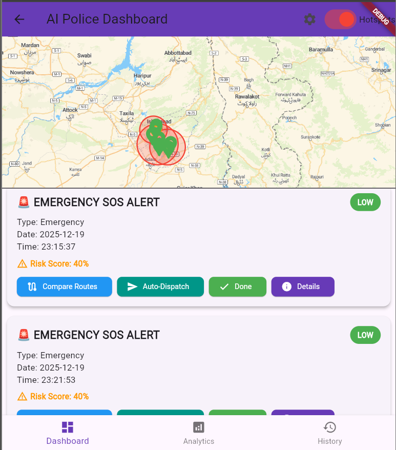
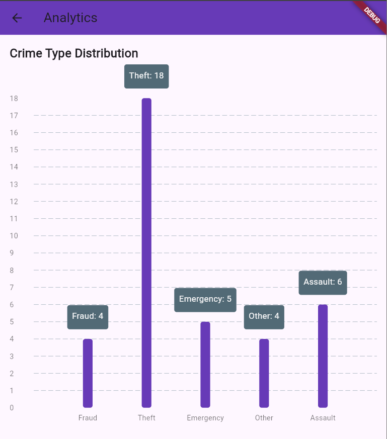
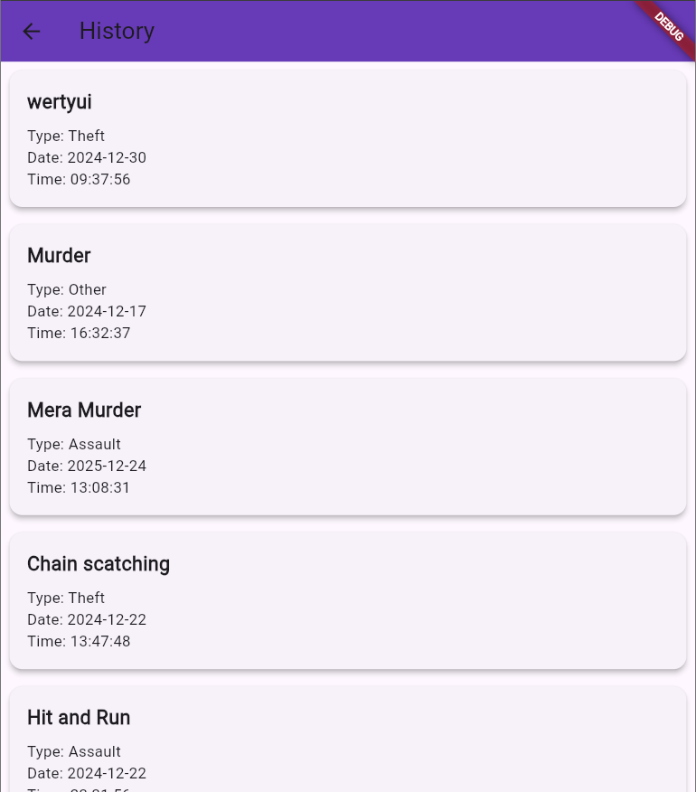
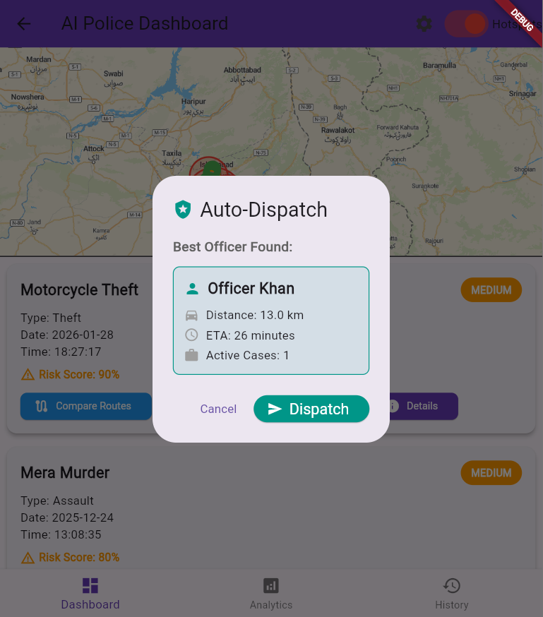
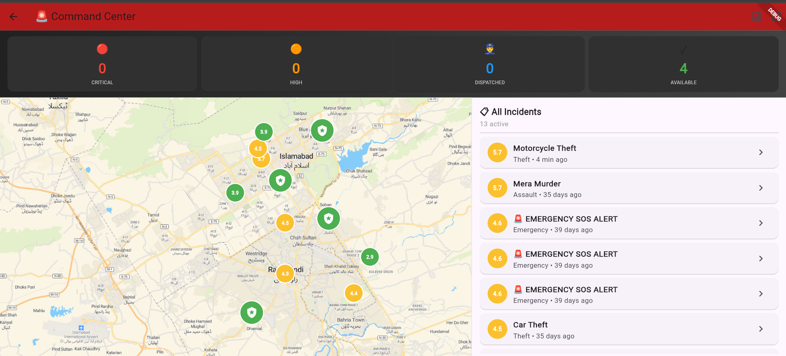
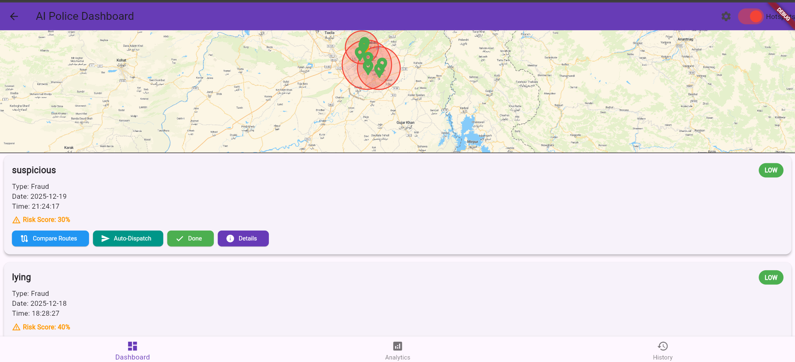

# AI-Powered Crime Reporting & Dispatch Optimization System

An intelligent **Flutter-based crime reporting and police dispatch platform** that uses **AI, algorithms, and geospatial analysis** to prioritize incidents, detect crime hotspots, and optimize officer response in real time.

This project focuses on **practical AI engineering**, demonstrating how machine learning concepts and optimization algorithms can be applied to real-world public safety systems.

---

## 🚓 Project Overview

Traditional crime reporting systems rely heavily on manual prioritization and delayed decision-making. This system improves emergency response by:

* Automatically prioritizing crime reports using AI-based scoring
* Identifying crime hotspots through clustering techniques
* Optimizing police dispatch to minimize response time
* Providing real-time dashboards for command-level monitoring

The goal is to make emergency response **faster, smarter, and data-driven**.

---

## ✨ Key Features

* **Real-time crime reporting** using Firebase
* **AI-based priority scoring** for incidents
* **Crime hotspot detection** using clustering algorithms
* **Optimized police dispatch** based on distance and workload
* **ETA calculation** for response units
* **Risk prediction** using spatial crime density
* **Central command dashboard** for live monitoring

---

## 📸 Screenshots

> Screenshots are available in the `/ss` folder and reflect the main application flow

### Main Screen

### Login

Login

### Register

### Dashboard

### Analytics

### History

### Dispatch

### Command Center

### Cluster View

---

## 🧠 AI & Algorithmic Highlights

* **K-Means Clustering** for crime hotspot detection
* **Greedy optimization algorithms** for officer assignment
* **A* pathfinding** for route planning
* **Priority Queue (Heap)** for incident management
* **Haversine distance formula** for geographic calculations
* **NLP keyword analysis** for danger detection
* **Weighted scoring systems** with time decay
* **State machines** for unit status management

---

## 🛠️ Technology Stack

* **Frontend:** Flutter, Dart
* **Backend:** Firebase
* **AI / Algorithms:**

  * Machine Learning (Clustering)
  * Graph Algorithms (A*)
  * Optimization Algorithms
  * NLP Techniques
  * Geospatial Analysis

---

## 🎯 Why This Project Stands Out

* Applies **AI concepts to a real-world problem**
* Focuses on **decision-making and optimization**, not just UI
* Demonstrates strong **problem-solving and system design** skills
* Suitable for **AI Engineer, Software Engineer, and Flutter Developer** roles

---

## 📜 License

Developed for academic and portfolio purposes.

---

## 📬 Contact

* Email: [maryamirfan803@gmail.com]
* GitHub: https://github.com/MaryamIrfan1
